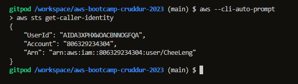
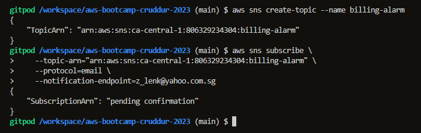
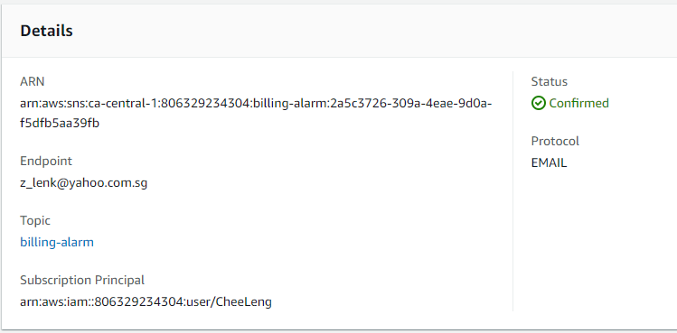
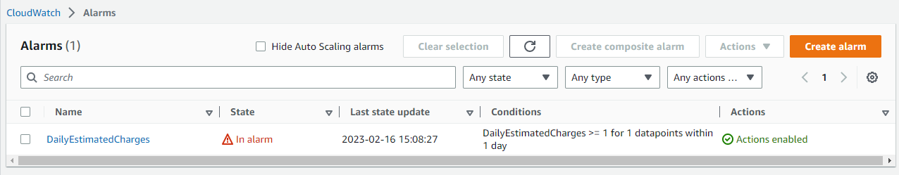
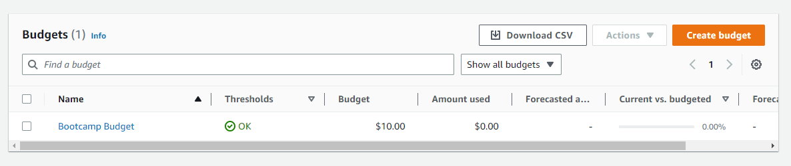
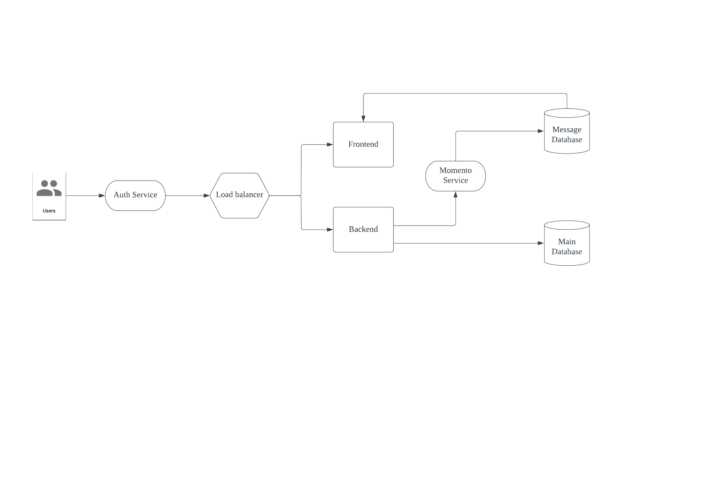
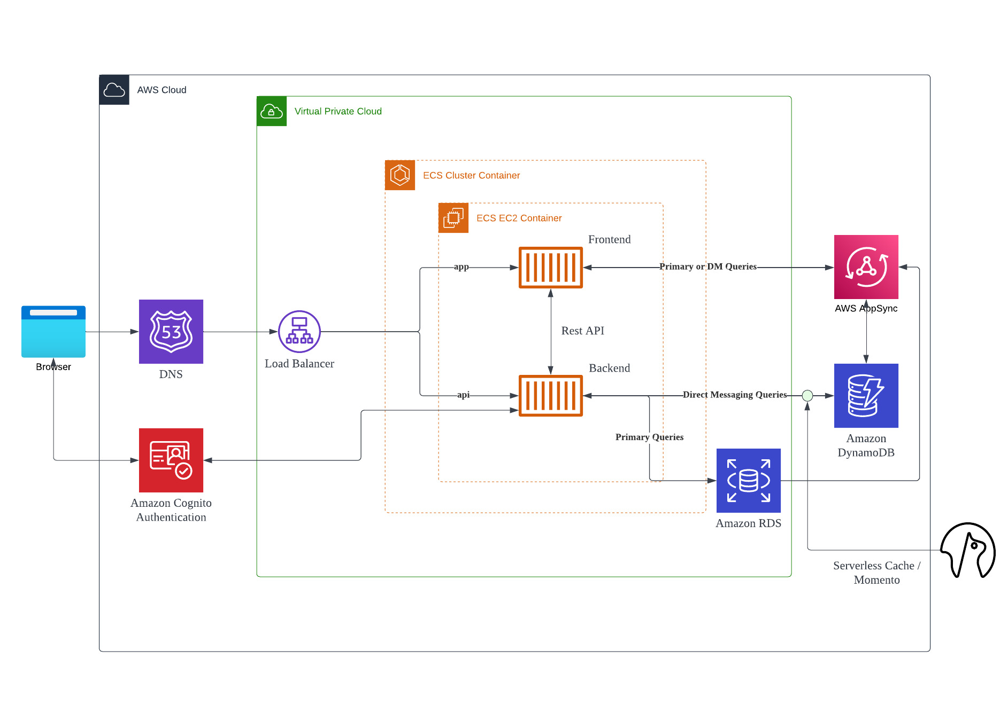

# Week 0 — Billing and Architecture

## Require Homework

### Install CLI
Refers to .gitpod.yml
https://github.com/fptycl/aws-bootcamp-cruddur-2023/blob/main/.gitpod.yml

### Create a SNS Topic and Subscription Alarm with endpoint to an email

### Create Alarm

### Create an AWS budget

### Conceptual Diagram
Here is the conceptual diagram drawn using Lucid Charts. Sorry no napkin here :). Environmental friendly

Viewable link
https://lucid.app/lucidchart/a7b78eaf-715e-4912-b308-80149e609706/edit?viewport_loc=-11%2C-11%2C1720%2C1036%2C0_0&invitationId=inv_45854c58-07de-4366-b35c-749f0c7bc33d

### Logical Architectual Diagram
Here is the logical architectual diagram drawn using Lucid Charts.

Viewable link 
https://lucid.app/lucidchart/9cded874-eae4-4701-bc1b-44499fce7a4f/edit?viewport_loc=-59%2C113%2C2113%2C1272%2C0_0&invitationId=inv_feee8156-2440-4ab4-8ee4-8f8189ea8842
