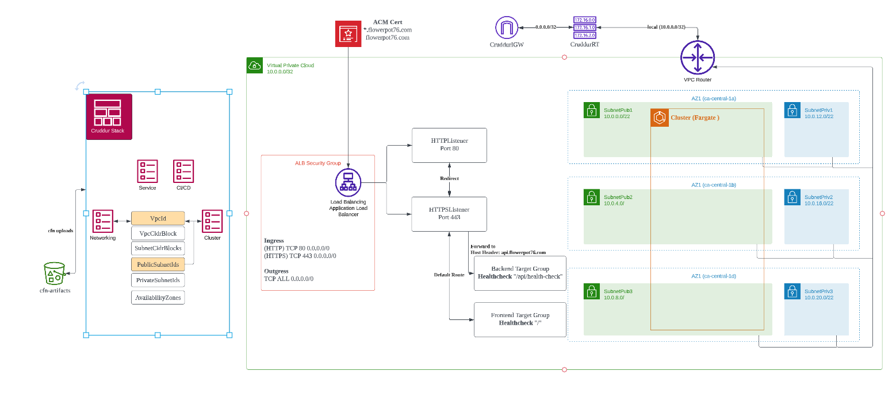

# Week 10 — CloudFormation Part 1

```sh
pip install cfn-lint
```

```sh
cfn-lint /worksapce/aws-bootcamp-cruddur-2023/aws/cfn/template.yaml
```

```sh
cargo install cfn-guard
```

```sh
cfn-guard generate /worksapce/aws-bootcamp-cruddur-2023/aws/cfn/task-definition.guard -o /worksapce/aws-bootcamp-cruddur-2023/aws/cfn/task-definition.ruleset
```

```sh
cfn-guard rulegen --template /worksapce/aws-bootcamp-cruddur-2023/aws/cfn/template.yaml
```

```sh
cd aws/cfn
cfn-guard validate -r ecs-cluster.guard 
```

### Cloudformatio diagram



https://lucid.app/lucidchart/2c11fd99-afb8-4bda-ac3a-230efca253f9/edit?view_items=QedXzYGLV-oV&invitationId=inv_eea7ac30-56a4-45a8-a203-b9df63cc88c0
