# Week 8 — Serverless Image Processing

## New Directory

Lets contain our cdk pipeline in a new top level directory called:

```sh
cd /workspace/aws-bootcamp-cruddur-2023
mkdir thumbing-serverless-cdk
```

## Install CDK globally

This is so we can use the AWS CDK CLI for anywhere.

```sh
npm install aws-cdk -g
```

We'll add the the install to our gitpod task file
```sh
  - name: cdk
    before: |
      npm install aws-cdk -g
```


## Initialize a new project

We'll initialize a new cdk project within the folder we created:

```sh
cdk init app --language typescript
```
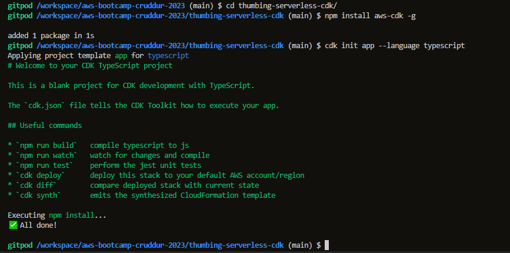

## Add an S3 Bucket

Add the following code to your `thumbing-serverless-cdk-stack.ts`

```ts
import * as s3 from 'aws-cdk-lib/aws-s3';

const bucketName: string = process.env.THUMBING_BUCKET_NAME as string;

const bucket = new s3.Bucket(this, 'ThumbingBucket', {
  bucketName: bucketName,
  removalPolicy: cdk.RemovalPolicy.DESTROY,
});
```

```sh
export THUMBING_BUCKET_NAME="cruddur-thumbs"
gp env THUMBING_BUCKET_NAME="cruddur-thumbs"
```

- [Bucket Construct](https://docs.aws.amazon.com/cdk/api/v2/docs/aws-cdk-lib.aws_s3.Bucket.html)
- [Removal Policy](https://docs.aws.amazon.com/cdk/api/v1/docs/@aws-cdk_core.RemovalPolicy.html)

## Bootstrapping

> Deploying stacks with the AWS CDK requires dedicated Amazon S3 buckets and other containers to be available to AWS CloudFormation during deployment. 

```sh
cdk bootstrap "aws://$AWS_ACCOUNT_ID/$AWS_DEFAULT_REGION"
```

## Build

We can use build to catch errors prematurely.
This jsut builds tyescript

```sh
npm run build
```


## Synth

> the synth command is used to synthesize the AWS CloudFormation stack(s) that represent your infrastructure as code.

```sh
cdk synth
```


## Deploy

```sh
cdk deploy
```

## List Stacks

```sh
cdk ls
```

## Load Env Vars
  ```ts
const dotenv = require('dotenv');
dotenv.config();

const bucketName: string = process.env.THUMBING_BUCKET_NAME as string;
const folderInput: string = process.env.THUMBING_S3_FOLDER_INPUT as string;
const folderOutput: string = process.env.THUMBING_S3_FOLDER_OUTPUT as string;
const webhookUrl: string = process.env.THUMBING_WEBHOOK_URL as string;
const topicName: string = process.env.THUMBING_TOPIC_NAME as string;
const functionPath: string = process.env.THUMBING_FUNCTION_PATH as string;
console.log('bucketName',bucketName)
console.log('folderInput',folderInput)
console.log('folderOutput',folderOutput)
console.log('webhookUrl',webhookUrl)
console.log('topicName',topicName)
console.log('functionPath',functionPath)
```

## Create Bucket

```ts
import * as s3 from 'aws-cdk-lib/aws-s3';

const bucket = this.createBucket(bucketName)

createBucket(bucketName: string): s3.IBucket {
  const logicalName: string = 'ThumbingBucket';
  const bucket = new s3.Bucket(this, logicalName , {
    bucketName: bucketName,
    removalPolicy: cdk.RemovalPolicy.DESTROY,
  });
  return bucket;
}
```

## Create Lambda

```ts
import * as lambda from 'aws-cdk-lib/aws-lambda';

const lambda = this.createLambda(folderInput,folderOutput,functionPath,bucketName)

createLambda(folderIntput: string, folderOutput: string, functionPath: string, bucketName: string): lambda.IFunction {
  const logicalName = 'ThumbLambda';
  const code = lambda.Code.fromAsset(functionPath)
  const lambdaFunction = new lambda.Function(this, logicalName, {
    runtime: lambda.Runtime.NODEJS_18_X,
    handler: 'index.handler',
    code: code,
    environment: {
      DEST_BUCKET_NAME: bucketName,
      FOLDER_INPUT: folderIntput,
      FOLDER_OUTPUT: folderOutput,
      PROCESS_WIDTH: '512',
      PROCESS_HEIGHT: '512'
    }
  });
  return lambdaFunction;
}
```

## Create SNS Topic

```ts
import * as sns from 'aws-cdk-lib/aws-sns';

const snsTopic = this.createSnsTopic(topicName)

createSnsTopic(topicName: string): sns.ITopic{
  const logicalName = "Topic";
  const snsTopic = new sns.Topic(this, logicalName, {
    topicName: topicName
  });
  return snsTopic;
}
```

## Create an SNS Subscription

```ts
import * as s3n from 'aws-cdk-lib/aws-s3-notifications';

this.createSnsSubscription(snsTopic,webhookUrl)

createSnsSubscription(snsTopic: sns.ITopic, webhookUrl: string): sns.Subscription {
  const snsSubscription = snsTopic.addSubscription(
    new subscriptions.UrlSubscription(webhookUrl)
  )
  return snsSubscription;
}
```

## Create S3 Event Notification to SNS

```ts
this.createS3NotifyToSns(folderOutput,snsTopic,bucket)

createS3NotifyToSns(prefix: string, snsTopic: sns.ITopic, bucket: s3.IBucket): void {
  const destination = new s3n.SnsDestination(snsTopic)
  bucket.addEventNotification(
    s3.EventType.OBJECT_CREATED_PUT, 
    destination,
    {prefix: prefix}
  );
}
```

## Create S3 Event Notification to Lambda

```ts
this.createS3NotifyToLambda(folderInput,laombda,bucket)

createS3NotifyToLambda(prefix: string, lambda: lambda.IFunction, bucket: s3.IBucket): void {
  const destination = new s3n.LambdaDestination(lambda);
    bucket.addEventNotification(s3.EventType.OBJECT_CREATED_PUT,
    destination,
    {prefix: prefix}
  )
}
```

## Create Policy for Bucket Access

```ts
const s3ReadWritePolicy = this.createPolicyBucketAccess(bucket.bucketArn)
```

## Create Policy for SNS Publishing

```ts
const snsPublishPolicy = this.createPolicySnSPublish(snsTopic.topicArn)
```

## Attach the Policies to the Lambda Role

```ts
lambda.addToRolePolicy(s3ReadWritePolicy);
lambda.addToRolePolicy(snsPublishPolicy);
```

## cdk synth
This will help to check the cdk code before deploy
* A few chnages need to be made. 
* Domain name have to be our own domain url.
* S3 bucket also need to be our own s3 bucket.
* Require to install npm install dotenv --save else the import dotenv will not work
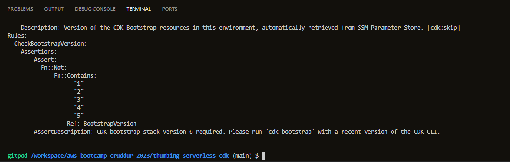

## cdk deploy
* Require to run cdk bootstrap for cdk deploy
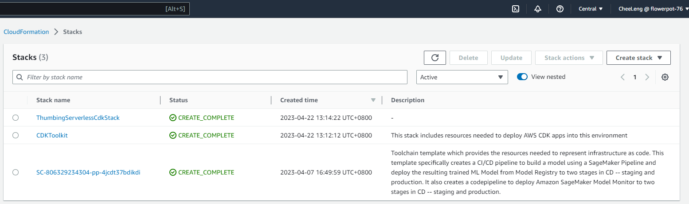

## Avatar upload and trigger lambda to process image and place it in assests s3 bucket
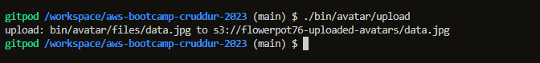
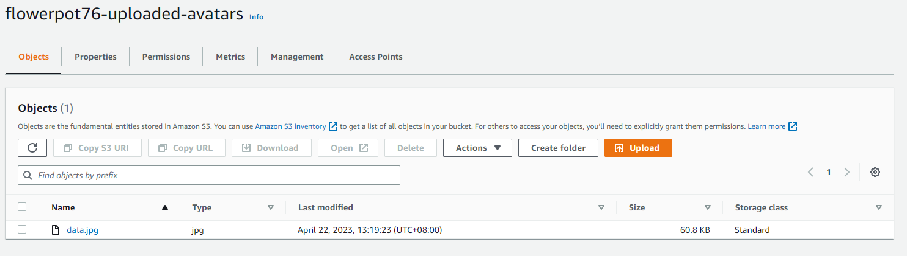
## Trigger lambda
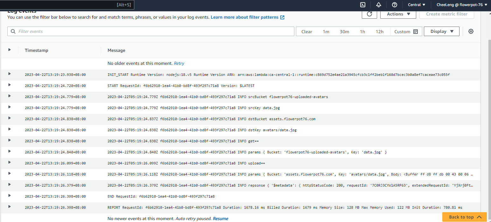
## Image processed and put in designated s3 bucket
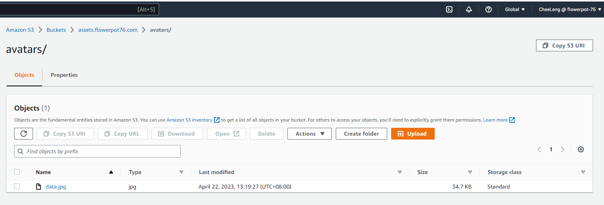

## cloudfront serving avatar example
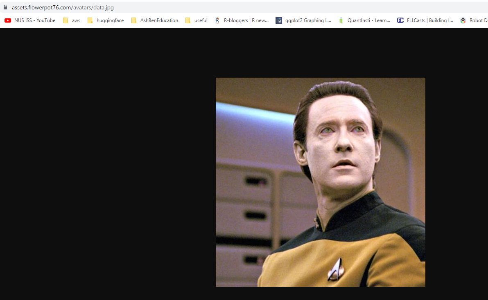

## Update to the cognito user script in order to solve the import lib.db
Need to append the sys path else the import lib.db will fail
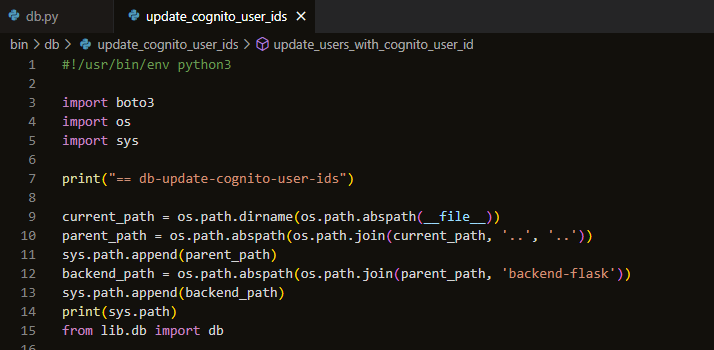

## Update to profile 
Need to change the profile to our own login else it will not load correctly
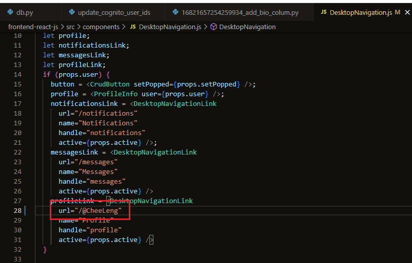

# Profile page
Successful load the profile page with the avatar and banner from s3. 
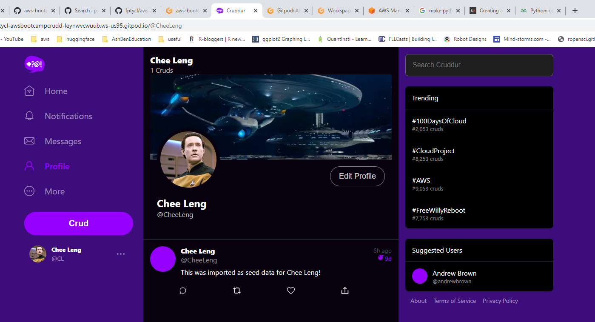

# Migration
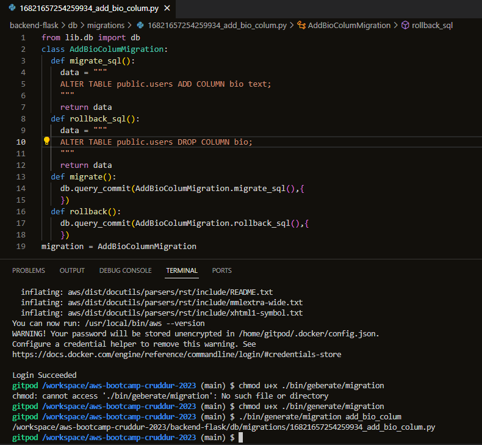

# Install aws-sdk for s3
```sh
npm i aws-sdk/client-s3 --save
```
