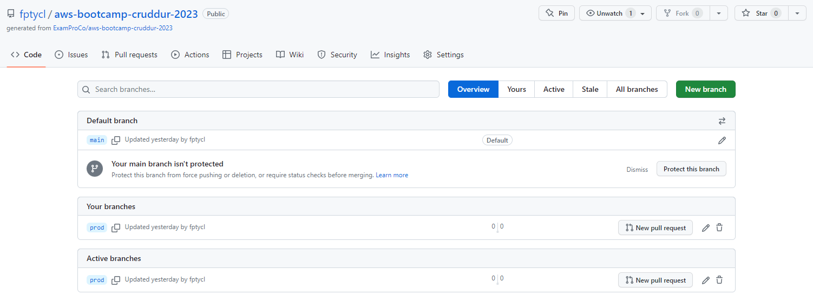
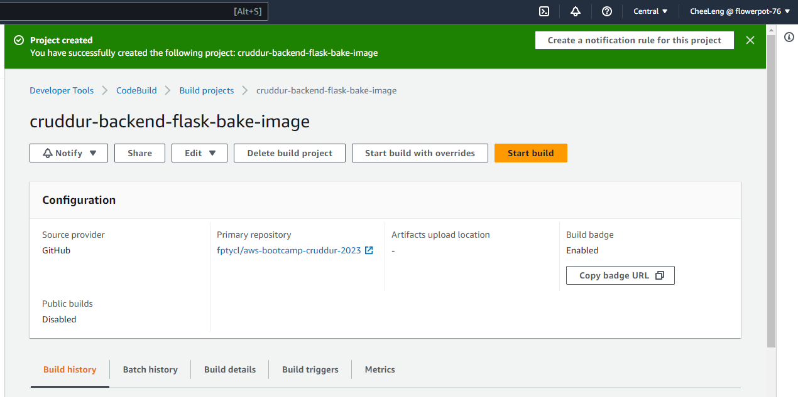
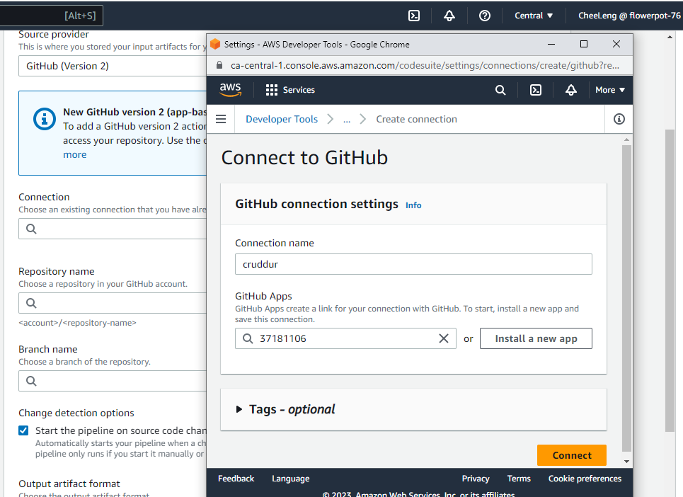
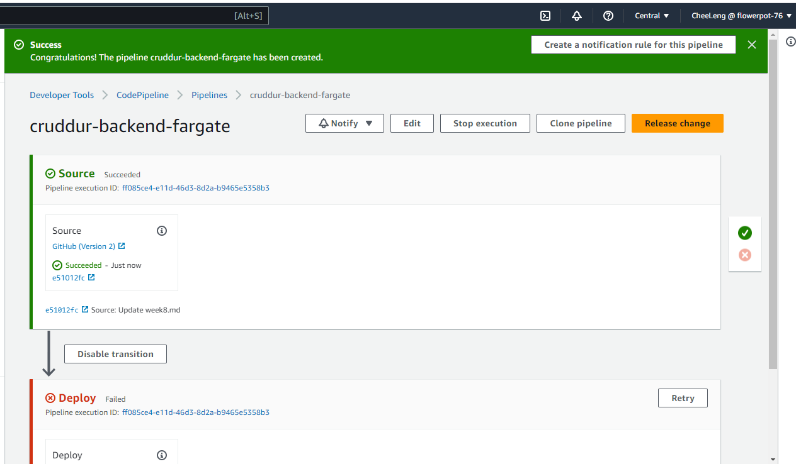
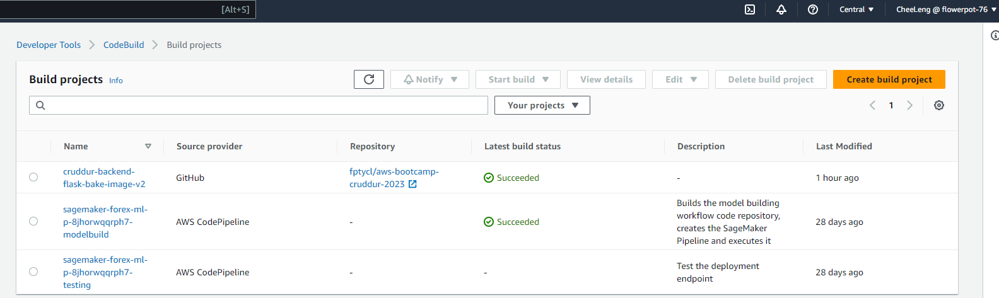
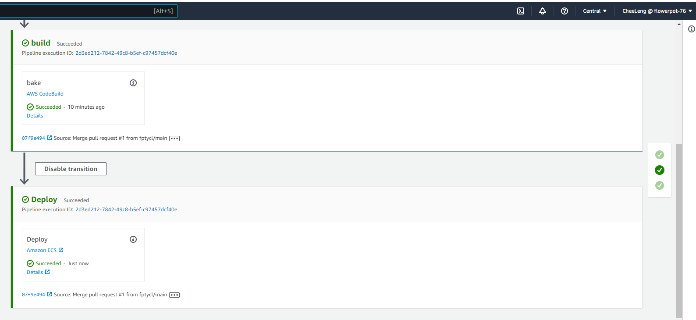

# Week 9 — CI/CD with CodePipeline, CodeBuild and CodeDeploy

## Setup prod branch

## Setup code build

## Setup code pipeline

*need to include AmazonEC2ContainerRegistryFullAccess policy in the build project policy and ecr:GetAuthorizationToken in the ecr permission in order for the cobe build to work
